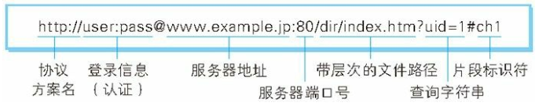
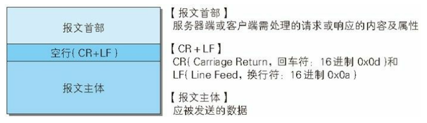
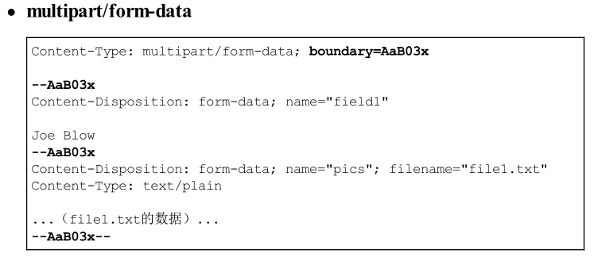
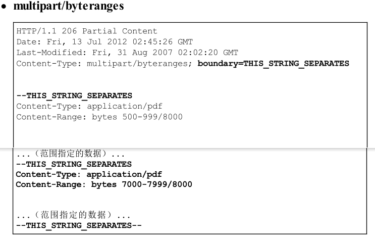
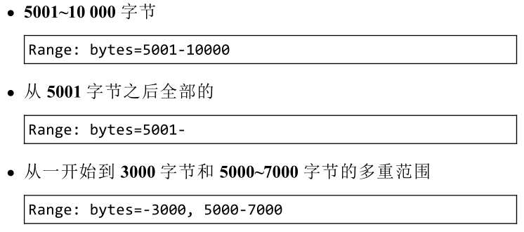
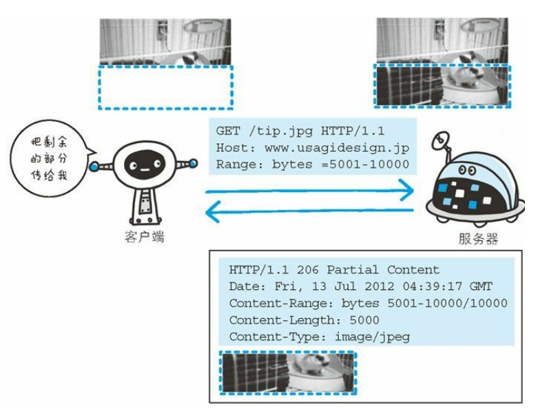
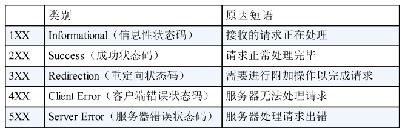
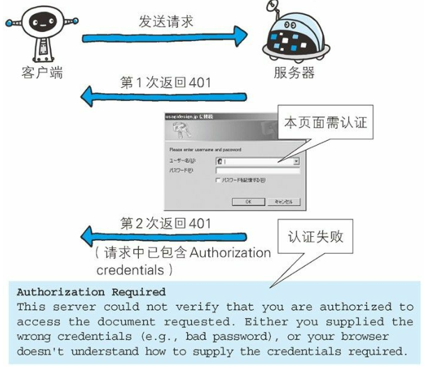

# HTTP学习记录

参考书籍:《图解HTTP》

------

## 1. Web与网络基础

### 1.1 概念

- URL
- 文件资源
- 客户端
- 超文本传输协议HTTP:作为规范，完成从客户端到服务段等一系列运作流程

### 1.2 TCP/IP

TCP/IP协议族，通信双方约定好的通信规则就叫协议

TCP/IP指互联网相关的各类协议族的总称

分层管理，4层：应用层、传输层、网络层、数据链路层

解释各层：

- 应用层

  决定了向用户提供应用服务时通信的活动，如FTP、DNS、HTTP

- 传输层

  对上层应用层提供处于网络连接中的两台计算机之间的数据传输。有两个性质不同的协议：TCP和UDP

- 网络层

  处理在网络上流动的数据包。数据包是传输的最小单位。该层规定了通过怎样的路径到达对方计算机，并把数据包传送给对方。

- 链路层

  用来处理连接网络的硬件部分。包括控制操作系统、硬件的设备驱动、网卡、光纤等物理可见部分。

通信传输流

利用TCP/IP协议族进行网络通信时，会通过分层顺序与对方进行通信。发送端从应用层往下走，接收端则往应用层往上走。以HTTP举例说明：首先作为发送端的客户端在应用层发出一个想看某个Web页面的HTTP请求。接着，为了传输方便，传输层把从应用层接收到的数据进行分割，并在各个报文上打上标记序号及端口号后转发给网络层。在网络层，增加作为通信目的地的MAC地址后转发给链路层。接收端的服务器在链路层接收到数据，按序往上层发送，一直到应用层。当传输到应用层，才能算真正接收到由客户端发送过来的HTTP请求。

封装：发送端在层与层之间传输数据时，每经过一层必定会被打赏一个该层所属的首部信息，反之接收端会将对应的首部消去，这种把数据信息包装起来的做法称为封装

### 1.3 IP、TCP和DNS

#### 1.3.1 负责传输的IP协议

IP网际协议位于网络层。其作用是把各种数据包发送给对方，而要满足保证确实传送到对方，则需要满足各类条件，最重要的是IP地址和MAC地址。

IP地址指明了节点被分配到的地址，MAC地址是指网卡所属的固定地址。IP地址和MAC地址可以进行配对。IP可变换，MAC基本上不会变。

使用ARP协议凭借MAC地址进行通信，IP间的通信依赖MAC地址，在网络上，通信双方处在同一局域网的情况很少，通常是经过多台计算机和网络设备中转才能连接到对方。进行中转时，会利用下一站中转设备的MAC地址来搜索下一个中转目标。这时会采用ARP协议，它可以通过IP地址反查出对应的MAC地址。

中转机制成为路由选择。

#### 1.3.2 确保可靠性的TCP协议

TCP位于传输层，提供可靠的字节流服务。

字节流服务：为了方便传输，将大块数据分割成以报文段为单位的数据包进行管理。

可靠的传输服务：能够将数据准确可靠地传输给对方。

为了准确无误地将数据送达目标处，TCP协议采用了三次握手策略。用TCP协议将数据包发送出去后，TCP会向对方确认是否成功送达。

握手过程使用了TCP的标志：SYN和ACK

#### 1.3.3 负责域名解析的DNS服务

DNS服务位于应用层。提供域名到IP地址之间的解析服务。

### 1.4 各种协议和HTTP协议的关系

### 1.5 URI和URL

URI：统一资源标识符Uniform Resource Identifier

- Uniform：规定统一的格式可方便处理多种不同类型的资源，而不用根据上下文环境来识别资源的访问方式。
- Resource：资源的定义是“可标识的任何东西”
- Identifier：表示可标识的对象。也称标识符

URI就是由某个协议方案表示的资源的定位标识符。协议方案是指访问资源所使用的协议类型名称

举例几种URI：

URL：统一资源定位符

#### 1.5.1 URI的格式

表示指定的 URI，要使用涵盖全部必要信息的绝对 URI、绝对 URL 以及相对 URL。

相对URL：从浏览器中基本URI处指定的URL，如/image/login.gif

绝对URI的格式：

- 使用http:或https:等协议方案名获取访问资源时要指定协议类型，不区分字母大小写，最后附一个冒号。也可使用data:或javascript:这类指定数据或脚本程序的方案名
- 登录信息：指定用户名和密码作为从服务器段获取资源时必要的登录信息。可选项
- 服务器地址：使用绝对URI必须指定待访问的服务器地址。可以是DNS可解析的名臣，也可以是IP地址
- 服务器端口号：指定服务器连接的网络端口号。可选项，省略时使用默认端口号。
- 带层次的文件路径：指定服务器上的文件路径来定位特指的资源。
- 查询字符串：针对已指定的文件路径内的资源，可以使用查询字符串传入任意参数。可选项
- 片段标识符：通常可标记出已获取资源中的子资源(文档内的某个位置)。可选项

## 2. 简单的HTTP协议

这里使用HTTP/1.1版本

### 2.1 HTTP协议用于客户端和服务器端之间的通信

请求访问文本或图像等资源的一端称为客户端，而提供资源响应的一端称为服务器端。

一条通信线路上必定有一端是客户端，另一端则是服务器端。

实际情况下，两台计算机作为客户端和服务器端的角色可能会互换。

### 2.2 通过请求和响应的交换达成通信

HTTP协议规定，请求从客户端发出，最后服务器端响应该请求并返回。

1. 下面是从客户端发送给某个HTTP服务器端的请求报文中的内容：

   

   - 起始行GET标识请求访问服务器的类型，成为方法(method)
   - 字符串"/index.htm"指明请求访问的资源对象，也叫请求URL
   - 最后HTTP/1.1表示HTTP的版本号

   请求报文是由请求方法、请求URI、协议版本、可选的请求首部字段和内容实体构成的。

   

2. 接收到请求的服务器，会将请求内容的处理结果以响应的形式返回，如下

   

   - 起始行开头的HTTP/1.1表示HTTP版本
   - 紧挨着的200 OK表示请求的处理结果的状态码(status code)和原因短语(reason-phrase)
   - 下一行显示创建响应的日期时间，属于首部字段的一个属性
   - 以空行为分隔，之后的内容称为资源实体的主体

   响应报文基本上由协议版本、状态码、用以解释状态码的原因短语、可选的响应首部字段以及实体主体构成。

   

### 2.3 HTTP不是保存状态的协议

HTTP是无状态协议。自身不对请求和响应之间的通信状态进行保存。即协议对于发送过的请求或响应都不做持久化处理(持久化是系统状态的一个特征，一般计算机是将某个状态作为数据存储在电脑数据存贮器以实现持久化。程式必须将数据存储在储存设备以及从存储设备中读取数据，并且必须提供本地编程语言数据结构和存储设备数据结构之间的映射)。

问题：一个购物网站跳转页面，仍要保持登录状态怎么办?

解决方案：Cookie技术

### 2.4 请求URI定位资源

HTTP使用URI定位互联网上的资源。客户端发起请求时，URI将被包含在请求报文内。指定请求URI的方式：

此外如果不是对访问特定资源而发起请求，可以使用*代替请求URI。比如查询HTTP服务器支持HTTP方法的种类：

### 2.5 告知服务器意图的HTTP方法

HTTP/1.1可使用的方法

- GET：获取资源

  用来请求访问已被URI识别的资源。指定的资源经服务器解析而后返回响应内容。如果请求的是文本，则原样返回；如果是CGI那样的程序，返回经过执行后的输出结果(这里注意一下CGI和API)。

  

- POST：传输实体主体

  GET方法也可以用来传输实体的主体，但是一般都是使用POST方法。

  

- PUT：传输文件

  在请求报文的主体中包含文件内容，然后保存到请求URI指定的位置。HTTP/1.1的PUT方法自身不带验证机制，存在安全性问题，因此一般的Web网站不适用该方法。

  

- HEAD：获得报文首部

  和GET方法一样，只是不返回报文主体部分。用于确认URI的有效性及资源更新的时间等

  

- DELETE：删除文件

  与PUT相反的方法，按请求URI删除指定的资源。因为不带验证机制，一般不用。

  

- OPTIONS：查询支持的方法

  查询针对请求URI指定的资源支持的方法

  

- TRACE：追踪路径

  让Web服务器端将之前的请求通信环回给客户端的方法。

  在发送请求时，在Max-Forwards首部字段中填入数值，每经过一个服务器端就将该数字减1，当数值减到0时，停止继续传输，最后接收到请求的服务器端则返回状态码200 OK的响应。

  客户端使用TRACE方法可以查询发送出去的请求是怎样被修改/篡改的。

  TRACE本身不常用，而且容易引发XST攻击。

  

- CONNECT：要求用隧道协议连接代理

  要求在于代理服务器通信时建立隧道，实现用隧道协议进行TCP通信。主要使用SSL和TLS协议把通信内容加密后经网络隧道传输。

  

### 2.6 使用方法下达命令

向请求URI指定的资源发送请求报文时，采用称为方法的命令。

方法的作用在于：可以指定请求的资源按期望产生某种行为。方法中有：GET、POST、HEAD等

### 2.7 持久连接节省通信量

每次的请求都会造成TCP连接的的建立和断开的开销

#### 2.7.1 持久连接

使用持久连接(HTTP keep-alive)的方法，只要任意一端没有明确提出断开连接，则保持TCP连接状态。这样就减少了TCP连接的重复建立和断开所造成的额外开销。

在HTTP/1.1中，所有的连接默认都是持久连接。

#### 2.7.2 管线化

在持久连接的基础上，可以使多数请求以管线化方式发送，即同时并行发送多个请求，而不需要一个接一个地等待响应。

### 2.8 使用Cookie的状态管理

HTTP是无状态协议，不会根据之前的状态进行本次的请求处理。

Cookie技术通过在请求和响应报文中写入Cookie信息来控制客户端的状态。

1. cookie会根据从服务器端发送的响应报文内一个叫做Set-Cookie的首部字段信息，通知客户端保存Cookie。当下次客户端再往这个服务器发送请求时，就会自动在请求报文中加入Cookie值后发送出去
2. 服务器端发现客户发送过来的Cookie后，会去检查究竟是从那一个客户端发来的连接请求，然后对比服务器上记录，最后得到之前的状态信息。

## 3. HTTP报文内的HTTP信息

HTTP通信过程包括从服务器发往服务器端的请求及从服务器端返回客户端的响应。

### 3.1 HTTP报文

用于HTTP协议交互的信息被称为HTTP报文。客户端的HTTP报文叫做请求报文，服务器端的叫做响应报文。报文本身由多行数据构成的字符串文本。用CR+LF换行。

### 3.2 请求报文及响应报文的结构

- 请求行：包含用于请求的版本、请求URI和HTTP版本

- 状态行：包含表明响应结果的状态码，原因短语和HTTP版本

- 首部字段：包含表示请求和响应的各种条件和属性的各类首部

  一般有四种首部：通用首部、请求首部、响应首部、实体首部

- 其他：包含HTTP的RFC里未定义的首部，如Cookie

### 3.3 编码提升传输速率

HTTP在传输过程中可以按照数据原貌原样直接传输，也可以在在传输过程中通过编码提升传输速率。

#### 3.3.1 报文主体和报文实体的差异

- 报文(message)：是HTTP通信中的基本单位，有8位组字节流组成，通过HTTP通信传输
- 实体(entity)：作为请求或响应的有效载荷数据被传输，其内容实体首部和实体主体组成

HTTP报文的主体用于传输请求或响应的实体主体，一般情况下报文主体=实体主体，当传输过程中进行编码操作，实体主体的内容会发生变化，导致其和报文主体产生差异。

#### 3.3.2 压缩传输的内容编码

HTTP协议中有一种被称为内容编码的功能，使报文体积变小。内容编码指明应用在实体内容上的编码形式，并保持实体信息原样压缩。内容编码后的实体由客户端接收并负责解码。常用的内容编码由以下几种：

- gzip(GNU ZIP)
- compress(UNIX系统的标准压缩)
- deflate(zlib)
- identity(不进行编码)

#### 3.3.3 分割发送的分块传输编码

把实体主体分块的功能称为分块传输编码。其将主体实体分成多个部分(块)，每一块都会用十六进制来标记块的大小，而实体主体的最后一块会使用"0(CR+LF)"来标记。使用分块传输编码的实体主体会由接收的客户端负责解码，恢复到编码前的实体主体。

### 3.4 发送多种数据的多部份对象集合

HTTP协议中采纳了多部分对象集合(Multipart)的机制，发送的一份报文主体内可含有多类型实体。通常在图片或文本文件等上传时使用

多部分对象集合包含的对象如下：

- multipart/form-data：在Web表单上传时使用
- multipart/byteranges：状态码206响应报文包含了多个范围的内容时使用

使用多部分对象集合时药在首部字段里加上Content-type，使用boundary字符串来划分多部分对象集合指明的各类实体。

多部分对象集合的每个部分类型中，都可以含有首部字段。另外可以在某个部分中嵌套使用多部分对象集合

### 3.5 获取部分内容的范围请求

在网络带宽不好的情况下，下载一个大文件一旦遇到网络中断，就要冲头开始。需要一种可恢复机制。

实现这个功能需要指定下载的实体范围。指定范围的发送请求叫做范围请求(Range Request)。对一份10000字节大小的资源，使用范围请求可以只请求5001到10000字节内的资源。

使用首部字段Range来指定资源的byte范围。byte范围的指定形式如下：

针对范围外请求，响应会返回状态码为206 的响应报文。对于多重范围的范围请求，响应会在首部字段Content-Type表明multipart/byteranges后返回响应报文。如果服务器无法响应范围请求，则会返回状态码200 OK和完整的实体内容

### 3.6 内容协商返回最合适的内容

内容协商指客户端和服务器端就相应的资源内容进行交涉，然后提供给客户端最为合适的资源。内容协商会以响应资源的语言、字符集、编码方式等作为判断的基准。

包含在请求报文中的某些首部字段就是判断的基准。如：Accept、Accept-Charset、Accept-Encoding、Accept-Language、Content-Language

内容协商有三种类型：

- 服务器驱动协商
- 客户端驱动协商
- 透明协商

## 4. 返回结果的HTTP状态码

HTTP状态码负责表示客户端HTTP请求的返回结果、标记服务器端的处理结果是否正常、通知出现的错误等工作。

### 4.1 状态码告知从服务器端返回的请求结果

状态码由三位数字和原因短语组成，由以下五类

### 4.2 2XX成功

响应结果表明请求被正常处理了

#### 4.2.1 200 OK

表示从客户端发来的请求在服务器端被正常处理了

在响应报文中，随状态码一起返回的信息会因方法的不同而发生改变。使用GET方法时，对应请求资源会的实体会作为响应返回。使用HEAD方法时，在响应报文中只返回首部，不会返回实体的主体部分。

#### 4.2.2 204 No Content

该状态码代表服务器接收的请求已经成功处理，但在返回的响应报文中不含实体的主体部分。另外，也不允许返回任何实体的主体。

一般只需要从客户端往服务器发送信息，而对客户端不需要发送新信息的情况下使用。

#### 4.2.3 206 Partial Content

该状态码表示客户端进行了范围请求，而服务器成功执行了这部分的GET请求。响应报文中包含由Content-Range指定范围的实体内容。

### 4.3 3XX重定向

响应结果表明浏览器需要执行某些特殊的处理以正确处理请求

#### 4.3.1 301 Moved Permanently

永久性重定向。该状态码表示请求的资源已经被重新分配了新的URI，以后应该使用资源现在所指的URL。按照Location首部字段提示的URI重新保存。

当指定资源路径最后忘记添加斜杠"/"，就会产生301状态码。

#### 4.3.2 302 Found

临时性重定向。该状态码表示请求的资源已经被分配了新的URI，希望用户本次能够使用新的URI访问。

和301类似，但是302表示资源不是被永久移动，只是临时性质的。

#### 4.3.3 303 See Other

该状态码表示由于请求对应的资源存在另一个URI，应使用GET方法定向获取请求的资源。

303和302有着相同的功能，但303明确表明客户端应采用GET方法获取资源。

#### 4.3.4 304 Not Modified

该状态码表示客户端发送附带条件的请求时，服务器端允许请求访问资源，但未满足的情况。304状态码返回时，不包含任何响应的主体部分。

#### 4.3.5 307 Temporary Redirect

临时重定向。与302相同。

### 4.4 4XX 客户端错误

4XX表明客户端是发生错误的原因所在

#### 4.4.1 400 Bad Request

表示请求报文中存在语法错误。需要修改请求的内容后再次发送请求。

#### 4.4.2 401 Unauthorized

该状态码表示发送的请求需要通过HTTP认证的认证信息。如果之前已经进行过一次请求，在表示用户认证失败。

#### 4.4.3 403 Forbidden

表明对请求资源的访问被服务器拒绝了。无需解释原因

#### 4.4.4 404 Not Found

该状态码表明服务器上无法找到请求的资源。，也可以在拒绝请求且不想说明理由时使用。

### 4.5 5XX服务器错误

表明服务器本身发生错误

#### 4.5.1 500 Intenal Server Error

表明服务器端在执行请求时发生了错误。也有可能是Web应用存在的bug或某些临时的故障。

#### 4.5.2 503 Service Unavailable

表明服务器暂时处于超负载或正在停机维护，现在无法处理请求。可以在RetryAfter首部字段写入解除维护时间返回给客户端

## 5. 与HTTP协作的Web服务器

## 6. HTTP首部

## 7. 确保Web安全的HTTPS

## 8. 确认访问用户身份的认证

## 9. 基于HTTP的功能追加协议

## 10. 构建Web内容的技术

## 11. Web的攻击技术